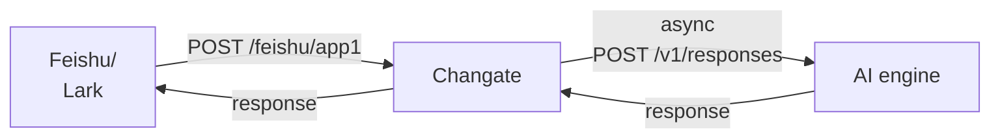

# Changate

Channel Gateway for Feishu and AI Agents.

## Overview

Changate is a gateway that connects Feishu (Lark) applications with AI Agent services. It receives message callbacks from Feishu apps, forwards messages to backend AI Agents (supporting Hermes and OpenClaw), and sends the Agent's response back to Feishu.



## Features

- **Multi-App Support**: Handle multiple Feishu apps via URL paths (e.g., `/feishu/app1`, `/feishu/app2`)
- **Multi-Agent Support**: Support for Hermes and OpenClaw agents via model configuration
- **Message Encryption**: AES-256-CBC encrypted callback content support
- **Signature Verification**: HMAC-SHA256 signature verification for request legitimacy
- **Async Processing**: Agent requests are processed asynchronously to avoid Feishu callback timeout
- **Session Persistence**: Configure `user` parameter for stable Agent sessions
- **Flexible Configuration**: Environment variable injection for sensitive configs
- **Image Processing**: Download images from Feishu messages, base64 encode and send to Agent
- **File Response**: Support Agent returning local file paths, upload to Feishu for sending

## Tech Stack

- **Language**: Golang 1.26+
- **Framework**: Gin Web Framework
- **Configuration**: Viper Configuration Management
- **CLI**: Cobra CLI Tool

## Project Structure

```
changate/
├── cmd/
│   └── server/
│       └── main.go           # Application entry point
├── config/
│   └── config.yaml           # Configuration file
├── internal/
│   ├── agent/
│   │   └── responses.go     # Agent client implementation
│   ├── config/
│   │   └── config.go         # Configuration loader
│   ├── feishu/
│   │   └── client.go         # Feishu API client
│   ├── handler/
│   │   ├── callback.go       # Callback handling logic
│   │   └── health.go         # Health check endpoint
│   ├── model/
│   │   ├── agent.go         # Agent response models
│   │   └── event.go         # Event data models
│   └── router/
│       └── router.go         # Route setup
└── pkg/
    ├── crypto/
    │   └── aes.go            # AES encryption utilities
    ├── logger/
    │   └── logger.go         # Logging utilities
    └── retry/
        └── retry.go           # Retry utilities
```

## Quick Start

### Requirements

- Golang 1.26+
- Feishu application with bot enabled
- Hermes Agent or OpenClaw Gateway

### Build

```bash
# Clone the project
git clone https://github.com/atompi/changate.git
cd changate

# Build
go build -o changate ./cmd/server
```

### Configuration

Edit `config/config.yaml`:

```yaml
server:
  host: "0.0.0.0"
  port: 8080
  read_timeout: 30s
  write_timeout: 30s

log_level: "info"

apps:
  - name: "app1"
    app_id: "${FEISHU_APP_ID_1}"
    app_secret: "${FEISHU_APP_SECRET_1}"
    encrypt_key: "${FEISHU_ENCRYPT_KEY_1}"
    verify_token: "${FEISHU_VERIFY_TOKEN_1}"
    feishu_base_url: "https://open.feishu.cn"

agent:
  base_url: "http://127.0.0.1:8642"
  api_path: "/v1/responses"
  timeout: 3600s
  model: "hermes-agent"
  token: "${HERMES_TOKEN}"
  user: ""                    # User identifier for session persistence
```

#### Configuration Reference

**Server Config**:
- `host` / `port`: Service listen address
- `read_timeout` / `write_timeout`: HTTP timeout settings

**Apps Config** (supports multiple Feishu apps):
- `name`: App identifier, used for URL path matching
- `app_id` / `app_secret`: Feishu app credentials
- `encrypt_key`: AES-256-CBC encryption key (optional)
- `verify_token`: Feishu callback verification token (optional)
- `feishu_base_url`: Feishu open platform address

**Agent Config**:
- `base_url`: Agent API address
- `api_path`: API path
- `timeout`: Request timeout
- `model`: Model name
- `token`: Authentication token
- `user`: User identifier for session persistence (optional)

#### Environment Variables

Sensitive configurations support environment variable injection with `${ENV_VAR_NAME}` format:

```bash
export FEISHU_APP_ID_1="cli_xxx"
export FEISHU_APP_SECRET_1="xxx"
export FEISHU_ENCRYPT_KEY_1="32-byte-key"
export FEISHU_VERIFY_TOKEN_1="xxx"
export HERMES_TOKEN="xxx"
```

### Run

```bash
# Start with config file
./changate server --config config/config.yaml

# Uses config/config.yaml by default
./changate server
```

### Feishu App Setup

1. Create a Feishu app in the Feishu Open Platform, enable bot functionality
2. Configure Event Subscriptions:
   - Enable `im.message.receive_v1` (Receive Messages)
   - Set request URL to `https://your-domain.com/feishu/app1`
3. After configuring the callback URL, Feishu will send a URL verification request

## API Endpoints

### Callback Endpoint

```
POST /feishu/:appName
```

Receives message callbacks from Feishu apps.

**Request Headers**:
- `X-Lark-Signature`: HMAC-SHA256 signature
- `X-Lark-Request-Timestamp`: Timestamp

**Request Body**:
```json
{
  "schema": "2.0",
  "header": {
    "event_id": "5e3702a84e847582be8db7fb73283c02",
    "event_type": "im.message.receive_v1",
    "create_time": "1608725989000",
    "token": "rvaYgkND1GOiu5MM0E1rncYC6PLtF7JV",
    "app_id": "cli_9f5343c580712544",
    "tenant_key": "2ca1d211f64f6438"
  },
  "event": {
    "sender": {
      "sender_id": {
        "union_id": "on_8ed6aa67826108097d9ee143816345",
        "user_id": "e33ggbyz",
        "open_id": "ou_84aad35d084aa403a838cf73ee18467"
      },
      "sender_type": "user",
      "tenant_key": "736588c9260f175e"
    },
    "message": {
      "message_id": "om_5ce6d572455d361153b7cb51da133945",
      "root_id": "om_5ce6d572455d361153b7cb5xxfsdfsdfdsf",
      "parent_id": "om_5ce6d572455d361153b7cb5xxfsdfsdfdsf",
      "create_time": "1609073151345",
      "chat_id": "oc_5ce6d572455d361153b7xx51da133945",
      "chat_type": "group",
      "message_type": "text",
      "content": "{\"text\":\"hello\"}",
      "mentions": []
    }
  }
}
```

**Response**:
- URL Verification: Returns `{"challenge": "xxx"}`
- Message Processing: Returns `{"code": 0}`

### Health Check

```
GET /health
```

Returns service health status.

**Response**:
```json
{"status": "ok"}
```

## Message Processing Flow

### Text Messages

1. **Receive Callback**: Changate receives Feishu callback request
2. **Decrypt & Verify**: If encryption key is configured, decrypt request body and verify signature
3. **Parse Message**: Parse event type, extract message content and message ID
4. **Async Processing**:
   - Serialize text content to Agent API format
   - After Agent returns response, send text reply to Feishu user
5. **Immediate Response**: Return `{"code": 0}` immediately after receiving callback to avoid timeout

### Image Messages

1. **Receive Callback**: Receive message with `message_type: "image"`
2. **Parse Image**: Extract `image_key`
3. **Download Image**: Call Feishu message resource download API `GET /open-apis/im/v1/messages/{message_id}/resources/{file_key}?type=image`
4. **Base64 Encode**: Encode image data as `data:image/png;base64,...` format
5. **Send to Agent**: Serialize as `{"type": "input_image", "image_url": "data:image/png;base64,..."}`
6. **Process Response**: Agent may return text or local file path

### File Response

When Agent response contains text in `MEDIA:/path/to/file.png` format:

1. Extract file path
2. Read local file
3. Upload to Feishu: `POST /open-apis/im/v1/files` (multipart/form-data)
4. Send file message to Feishu user

## Security

### Encrypted Callbacks

If Feishu is configured with "Use Encryption", the request body contains an `encrypt` field:

```json
{
  "encrypt": "base64-encoded-encrypted-content"
}
```

Changate uses AES-256-CBC for decryption. Configure `encrypt_key` to enable.

### Signature Verification

Feishu callbacks carry `X-Lark-Signature` and `X-Lark-Request-Timestamp` headers. Changate verifies using HMAC-SHA256:

```
signature = HMAC-SHA256(encryptKey, timestamp + body)
```

### Token Verification

If `verify_token` is configured, Changate verifies the `token` field in the request.

## Agent Interface

### Hermes Agent

Request format (using `/v1/responses` API):

```json
{
  "model": "hermes-agent",
  "input": [
    {"role": "user", "content": "User message"}
  ],
  "user": "user-identifier",
  "stream": false
}
```

### OpenClaw Gateway

Request format (using `/v1/responses` API):

```json
{
  "model": "openclaw/default",
  "input": [
    {"role": "user", "content": [{"type": "text", "text": "User message"}]}
  ],
  "user": "user-identifier",
  "stream": false
}
```

OpenClaw supports content parts format and multimodal content (text + images).

### Agent Image Format

Image format sent to Agent:

```json
{
  "role": "user",
  "content": [
    {"type": "input_image", "image_url": "data:image/png;base64,iVBORw0KG..."}
  ]
}
```

### Agent File Path Response

When Agent returns text containing `MEDIA:` prefix, system extracts file path:

```
MEDIA:/opt/data/cache/screenshots/browser_screenshot_xxx.png
```

System will read the file and upload to Feishu.

## Logging

Changate uses structured logging with the following levels:

- `debug`: Detailed debug info (includes request/response bodies)
- `info`: General information
- `warn`: Warning information
- `error`: Error information

Log level is set via the `log_level` configuration item.

## Testing

```bash
# Run all tests
go test ./...

# Run tests with coverage
go test -cover ./...
```

## License

[MIT](./LICENSE)
