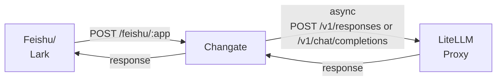

# Changate

Channel Gateway for Feishu (Lark) and AI Agent Services.

## Overview

Changate acts as a bridge between Feishu (Lark) applications and AI Agent services. It receives message callbacks from Feishu, forwards them to backend AI Agents (via LiteLLM proxy), and sends the Agent responses back to Feishu.



## Features

- **ETCD Configuration Management**: Centralized multi-app configuration via ETCD with per-user agent override support
- **Multi-Agent Support**: Supports both OpenResponses and ChatCompletions API types via LiteLLM proxy
- **Message Encryption**: AES-256-CBC encryption for callback content
- **Signature Verification**: HMAC-SHA256 signature validation
- **Async Processing**: Agent requests executed asynchronously to prevent Feishu callback timeout
- **Session Persistence**: Configure `user` parameter for stable Agent sessions
- **Image Processing**: Download Feishu images, base64 encode, and send to Agent
- **File Reply**: Upload local files from Agent response (`MEDIA:/path/to/file`) to Feishu
- **Agent Client Caching**: LRU+TTL cache to reduce repeated creation overhead
- **MCP Tools**: Pass MCP server information to LiteLLM proxy via `tools` configuration
- **Retry Logic**: Exponential backoff retry for transient network failures and 5xx errors

## Tech Stack

- **Language**: Go 1.26+
- **Framework**: Gin Web Framework
- **Configuration**: Viper

## Project Structure

```
changate/
├── cmd/
│   └── server/
│       └── main.go               # Entry point
├── internal/
│   ├── agent/
│   │   ├── client.go             # Client interface + NewClient factory
│   │   ├── agent_http.go         # Unified HTTP client + builders
│   │   └── agent_test.go         # Unit tests
│   ├── config/
│   │   ├── config.go              # Config structs + Load function
│   │   └── etcd_loader.go        # ETCD config loader
│   ├── etcd/
│   │   └── client.go              # ETCD client
│   ├── feishu/
│   │   └── client.go              # Feishu API client
│   ├── handler/
│   │   ├── callback.go            # Callback handling logic
│   │   ├── agent_cache.go         # LRU+TTL Agent client cache
│   │   └── agent_cache_test.go    # Cache tests
│   ├── model/
│   │   ├── agent.go               # Agent response models
│   │   ├── event.go               # Event data models
│   │   └── model_test.go          # Model tests
│   └── router/
│       └── router.go             # Gin router setup
└── pkg/
    ├── crypto/
    │   └── aes.go                 # AES encryption/decryption
    ├── logger/
    │   └── logger.go              # Structured logging
    └── retry/
        └── retry.go               # Retry logic
```

## Quick Start

### Requirements

- Go 1.26+
- Feishu App (with Bot enabled)
- LiteLLM Proxy (supporting `/v1/responses` or `/v1/chat/completions`)

### Build

```bash
git clone https://github.com/atompi/changate.git
cd changate
go build -o changate ./cmd/server
```

### Configuration

Edit `config/config.yaml`:

```yaml
server:
  host: "0.0.0.0"
  port: 8080
  read_timeout: 30s
  write_timeout: 30s

log_level: "debug"

etcd:
  endpoints:
    - "http://127.0.0.1:2379"
  timeout: 5s
  root_path: "/changate"
```

#### ETCD Configuration Structure

| Path | Description |
|------|-------------|
| `/changate/<app_name>` | App-level config (enabled + default agent) |
| `/changate/<app_name>/<user_id>` | User-level config (enabled + agent override) |

**App Config Example**:
```json
{
  "enabled": true,
  "app_id": "cli_xxxxxxxx",
  "app_secret": "xxxxxxxx",
  "encrypt_key": "xxxxxxxx",
  "verify_token": "xxxxxxxx",
  "feishu_base_url": "https://open.feishu.cn",
  "max_concurrent": 100,
  "timeout": 120,
    "agent": {
      "type": "ChatCompletions",
      "base_url": "https://litellm-proxy.example.com",
      "api_path": "/v1/chat/completions",
      "timeout": 120,
      "max_retries": 3,
      "retry_base_delay": "100ms",
      "model": "sf/Qwen/Qwen3-30B-A3B",
      "token": "sk-xxxxxxxx",
      "user": "default",
      "system_prompt": "",
      "tool_choice": "auto",
      "tools": [
        {
          "type": "mcp",
          "server_url": "litellm_proxy/mcp/wiki_mcp",
          "server_label": "wiki_search",
          "require_approval": "never"
        }
      ]
    }
}
```

**User Config Example**:
```json
{
  "enabled": true,
  "agent": {
    "type": "OpenResponses",
    "base_url": "https://litellm-proxy.example.com",
    "max_retries": 3,
    "retry_base_delay": "100ms",
    "model": "minimax/MiniMax-M2.7",
    "token": "sk-xxxxxxxx",
    "user": "bob",
    "tools": [
      {
        "type": "mcp",
        "server_url": "litellm_proxy/mcp/wiki_mcp",
        "server_label": "wiki",
        "require_approval": "never"
      }
    ]
  }
}
```

### Run

```bash
./changate server --config config/config.yaml
```

### Feishu App Setup

1. Create a Feishu app and enable Bot functionality
2. Configure event subscription:
   - Enable `im.message.receive_v1` (receive messages)
   - Set callback URL to `https://your-domain.com/feishu/app1`

## API Endpoints

### Callback

```
POST /feishu/:appName
```

Receives Feishu message callbacks.

**Headers**:
- `X-Lark-Signature`: HMAC-SHA256 signature
- `X-Lark-Request-Timestamp`: Timestamp

**Response**:
- URL verification: `{"challenge": "xxx"}`
- Message handling: `{"code": 0}`

### Health Check

```
GET /health
```

Returns `{"status": "ok"}`.

## LiteLLM Proxy API

### Chat Completions API

```json
{
  "model": "sf/Qwen/Qwen3-30B-A3B",
  "messages": [
    {"role": "user", "content": [
        {"type": "text", "text": "user message"},
        {"type": "image_url", "image_url": {"url": "data:image/png;base64,..."}}
    ]}
  ],
  "tools": [
    {
      "type": "mcp",
      "server_url": "litellm_proxy/mcp/wiki_mcp",
      "server_label": "wiki_search",
      "require_approval": "never"
    }
  ],
  "user": "user-identifier",
  "tool_choice": "auto"
}
```

### Responses API

```json
{
  "model": "minimax/MiniMax-M2.7",
  "input": [
    {"role": "user", "content": [
        {"type": "input_text", "text": "user message"},
        {"type": "input_image", "image_url": "data:image/png;base64,..."}
    ]}
  ],
  "tools": [
    {
      "type": "mcp",
      "server_url": "litellm_proxy/mcp/wiki_mcp",
      "server_label": "wiki",
      "require_approval": "never"
    }
  ],
  "user": "user-identifier",
  "tool_choice": "required"
}
```

## Message Processing

### Text Messages

1. **Receive callback**: Changate receives Feishu callback
2. **Decrypt & Verify**: Decrypt body and verify signature if `encrypt_key` configured
3. **Parse message**: Extract content and message ID
4. **Async processing**:
   - Serialize content to Agent API format
   - Send reply to Feishu user after Agent responds
5. **Immediate response**: Return `{"code": 0}` immediately to avoid timeout

### Image Messages

1. **Receive callback**: Extract `image_key`
2. **Download image**: `GET /open-apis/im/v1/messages/{message_id}/resources/{file_key}?type=image`
3. **Base64 encode**: Convert to `data:image/png;base64,...`
4. **Send to Agent**: `{"type": "input_image", "image_url": "data:image/png;base64,..."}`

### File Reply

When Agent response contains `MEDIA:/path/to/file.png`:

1. Extract file path
2. Read local file
3. Upload to Feishu: `POST /open-apis/im/v1/files` (multipart/form-data)
4. Send file message to user

## Logging

Structured logging with levels:

- `debug`: Request/response bodies (when `log_level: debug`)
- `info`: General information
- `warn`: Warning information (includes retry attempts)
- `error`: Error information

## Testing

```bash
go test ./...
go test -cover ./...
```

## License

[MIT](./LICENSE)