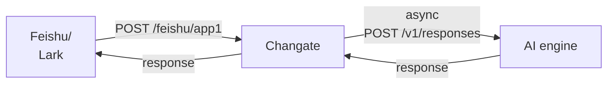

# Changate

通知通道网关 (Channel Gateway)。

## 概述

Changate 是一个连接飞书（Feishu/Lark）应用与 AI Agent 服务的通道网关。它接收飞书应用的消息回调，将消息转发给后端 AI Agent（支持 Hermes 和 OpenClaw），并把 Agent 的响应发送回飞书。



## 功能特性

- **多应用支持**：通过 URL 路径（如 `/feishu/app1`、`/feishu/app2`）区分多个飞书应用
- **多 Agent 支持**：支持通过 model 配置选择 Hermes 或 OpenClaw Agent
- **消息加密**：支持 AES-256-CBC 加密回调内容
- **签名验证**：支持 HMAC-SHA256 签名验证请求合法性
- **异步处理**：Agent 请求异步执行，避免飞书回调超时
- **会话保持**：支持配置 `user` 参数实现稳定的 Agent 会话
- **灵活配置**：支持环境变量注入敏感配置
- **图片处理**：支持下载飞书消息中的图片，base64 编码后发送给 Agent
- **文件回复**：支持 Agent 返回本地文件路径，上传至飞书发送

## 技术栈

- **语言**：Golang 1.26+
- **框架**：Gin Web 框架
- **配置**：Viper 配置管理
- **命令行**：Cobra CLI 工具

## 项目结构

```
changate/
├── cmd/
│   └── server/
│       └── main.go           # 程序入口
├── config/
│   └── config.yaml           # 配置文件
├── internal/
│   ├── agent/
│   │   └── responses.go     # Agent 客户端实现
│   ├── config/
│   │   └── config.go        # 配置加载
│   ├── feishu/
│   │   └── client.go        # 飞书 API 客户端
│   ├── handler/
│   │   ├── callback.go      # 回调处理逻辑
│   │   └── health.go        # 健康检查
│   ├── model/
│   │   ├── agent.go         # Agent 响应模型
│   │   └── event.go         # 事件数据模型
│   └── router/
│       └── router.go         # 路由设置
└── pkg/
    ├── crypto/
    │   └── aes.go            # AES 加解密工具
    ├── logger/
    │   └── logger.go         # 日志工具
    └── retry/
        └── retry.go          # 重试工具
```

## 快速开始

### 环境要求

- Golang 1.26+
- 飞书应用（已开启机器人功能）
- Hermes Agent 或 OpenClaw Gateway

### 安装构建

```bash
# 克隆项目
git clone https://github.com/atompi/changate.git
cd changate

# 构建
go build -o changate ./cmd/server
```

### 配置

编辑 `config/config.yaml`：

```yaml
server:
  host: "0.0.0.0"
  port: 8080
  read_timeout: 30s
  write_timeout: 30s

log_level: "info"

apps:
  - name: "app1"
    app_id: "${FEISHU_APP_ID_1}"
    app_secret: "${FEISHU_APP_SECRET_1}"
    encrypt_key: "${FEISHU_ENCRYPT_KEY_1}"
    verify_token: "${FEISHU_VERIFY_TOKEN_1}"
    feishu_base_url: "https://open.feishu.cn"

agent:
  base_url: "http://127.0.0.1:8642"
  api_path: "/v1/responses"
  timeout: 3600s
  model: "hermes-agent"
  token: "${HERMES_TOKEN}"
  user: ""                    # 用于会话保持的 user 标识
```

#### 配置说明

**Server 配置**：
- `host` / `port`：服务监听地址
- `read_timeout` / `write_timeout`：HTTP 超时时间

**Apps 配置**（支持多个飞书应用）：
- `name`：应用标识，用于 URL 路径匹配
- `app_id` / `app_secret`：飞书应用凭证
- `encrypt_key`：AES-256-CBC 加密密钥（可选）
- `verify_token`：飞书回调验证 Token（可选）
- `feishu_base_url`：飞书开放平台地址

**Agent 配置**：
- `base_url`：Agent API 地址
- `api_path`：API 路径
- `timeout`：请求超时时间
- `model`：模型名称
- `token`：认证 Token
- `user`：用户标识，用于会话保持（可选）

#### 环境变量

敏感配置支持环境变量注入，格式为 `${ENV_VAR_NAME}`：

```bash
export FEISHU_APP_ID_1="cli_xxx"
export FEISHU_APP_SECRET_1="xxx"
export FEISHU_ENCRYPT_KEY_1="32位密钥"
export FEISHU_VERIFY_TOKEN_1="xxx"
export HERMES_TOKEN="xxx"
```

### 运行

```bash
# 指定配置文件启动
./changate server --config config/config.yaml

# 默认使用 config/config.yaml
./changate server
```

### 飞书应用配置

1. 在飞书开放平台创建应用，启用机器人功能
2. 配置事件订阅：
   - 勾选 `im.message.receive_v1`（接收消息）
   - 设置请求地址为 `https://your-domain.com/feishu/app1`
3. 配置好回调地址后，飞书会发送 URL 验证请求

## API 接口

### 回调接口

```
POST /feishu/:appName
```

接收飞书应用的消息回调。

**请求头**：
- `X-Lark-Signature`：HMAC-SHA256 签名
- `X-Lark-Request-Timestamp`：时间戳

**请求体**：
```json
{
  "schema": "2.0",
  "header": {
    "event_id": "5e3702a84e847582be8db7fb73283c02",
    "event_type": "im.message.receive_v1",
    "create_time": "1608725989000",
    "token": "rvaYgkND1GOiu5MM0E1rncYC6PLtF7JV",
    "app_id": "cli_9f5343c580712544",
    "tenant_key": "2ca1d211f64f6438"
  },
  "event": {
    "sender": {
      "sender_id": {
        "union_id": "on_8ed6aa67826108097d9ee143816345",
        "user_id": "e33ggbyz",
        "open_id": "ou_84aad35d084aa403a838cf73ee18467"
      },
      "sender_type": "user",
      "tenant_key": "736588c9260f175e"
    },
    "message": {
      "message_id": "om_5ce6d572455d361153b7cb51da133945",
      "root_id": "om_5ce6d572455d361153b7cb5xxfsdfsdfdsf",
      "parent_id": "om_5ce6d572455d361153b7cb5xxfsdfsdfdsf",
      "create_time": "1609073151345",
      "chat_id": "oc_5ce6d572455d361153b7xx51da133945",
      "chat_type": "group",
      "message_type": "text",
      "content": "{\"text\":\"hello\"}",
      "mentions": []
    }
  }
}
```

**响应**：
- URL 验证：返回 `{"challenge": "xxx"}`
- 消息处理：返回 `{"code": 0}`

### 健康检查

```
GET /health
```

返回服务健康状态。

**响应**：
```json
{"status": "ok"}
```

## 消息处理流程

### 文本消息

1. **接收回调**：Changate 接收飞书回调请求
2. **解密验证**：如果配置了加密密钥，解密请求体并验证签名
3. **解析消息**：解析事件类型，提取消息内容和消息 ID
4. **异步处理**：
   - 将文本内容序列化为 Agent API 格式
   - Agent 返回响应后，发送文本回复给飞书用户
5. **立即响应**：收到回调后立即返回 `{"code": 0}`，避免超时

### 图片消息

1. **接收回调**：接收到包含 `message_type: "image"` 的消息
2. **解析图片**：提取 `image_key`
3. **下载图片**：调用飞书消息资源下载接口 `GET /open-apis/im/v1/messages/{message_id}/resources/{file_key}?type=image`
4. **Base64 编码**：将图片数据编码为 `data:image/png;base64,...` 格式
5. **发送给 Agent**：序列化为 `{"type": "input_image", "image_url": "data:image/png;base64,..."}`
6. **处理响应**：Agent 可能返回文本或本地文件路径

### 文件回复

当 Agent 响应包含 `MEDIA:/path/to/file.png` 格式的文本时：

1. 提取文件路径
2. 读取本地文件
3. 上传至飞书：`POST /open-apis/im/v1/files`（multipart/form-data）
4. 发送文件消息给飞书用户

## 安全机制

### 加密回调

如果飞书配置了「使用加密」，请求体会包含 `encrypt` 字段：

```json
{
  "encrypt": "base64 编码的加密内容"
}
```

Changate 使用 AES-256-CBC 解密。配置 `encrypt_key` 启用。

### 签名验证

飞书回调会携带 `X-Lark-Signature` 和 `X-Lark-Request-Timestamp` 头。Changate 使用 HMAC-SHA256 验证：

```
signature = HMAC-SHA256(encryptKey, timestamp + body)
```

### Token 验证

如果配置了 `verify_token`，Changate 会验证请求中的 `token` 字段。

## Agent 接口

### Hermes Agent

请求格式（使用 `/v1/responses` API）：

```json
{
  "model": "hermes-agent",
  "input": [
    {"role": "user", "content": "用户消息"}
  ],
  "user": "user-identifier",
  "stream": false
}
```

### OpenClaw Gateway

请求格式（使用 `/v1/responses` API）：

```json
{
  "model": "openclaw/default",
  "input": [
    {"role": "user", "content": [{"type": "text", "text": "用户消息"}]}
  ],
  "user": "user-identifier",
  "stream": false
}
```

OpenClaw 支持 content parts 格式，支持多模态内容（文本 + 图片）。

### Agent 图片格式

发送给 Agent 的图片格式：

```json
{
  "role": "user",
  "content": [
    {"type": "input_image", "image_url": "data:image/png;base64,iVBORw0KG..."}
  ]
}
```

### Agent 文件路径响应

当 Agent 返回包含 `MEDIA:` 前缀的文本时，系统会提取文件路径：

```
MEDIA:/opt/data/cache/screenshots/browser_screenshot_xxx.png
```

系统会读取该文件并上传至飞书。

## 日志

Changate 使用结构化日志，支持以下级别：

- `debug`：详细调试信息（包含请求/响应体）
- `info`：一般信息
- `warn`：警告信息
- `error`：错误信息

日志级别通过 `log_level` 配置项设置。

## 测试

```bash
# 运行所有测试
go test ./...

# 运行测试并显示覆盖率
go test -cover ./...
```

## License

[MIT](./LICENSE)
