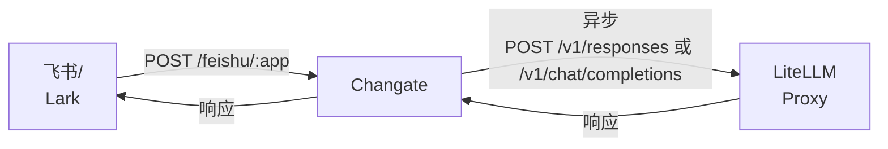

# Changate

飞书 (Feishu/Lark) 与 AI Agent 服务的通道网关。

## 概述

Changate 是连接飞书应用与 AI Agent 服务的通道网关。它接收飞书应用的消息回调，将消息转发给后端 AI Agent（通过 LiteLLM proxy），并把 Agent 的响应发送回飞书。



## 功能特性

- **ETCD 配置管理**：通过 ETCD 集中管理多 app 配置，支持 per-user agent 覆盖
- **多 Agent 支持**：通过 LiteLLM proxy 支持 OpenResponses 和 ChatCompletions 两种 API 类型
- **消息加密**：支持 AES-256-CBC 加密回调内容
- **签名验证**：支持 HMAC-SHA256 签名验证请求合法性
- **异步处理**：Agent 请求异步执行，避免飞书回调超时
- **会话保持**：支持配置 `user` 参数实现稳定的 Agent 会话
- **图片处理**：支持下载飞书消息中的图片，base64 编码后发送给 Agent
- **文件回复**：支持 Agent 返回本地文件路径 (`MEDIA:/path/to/file`)，上传至飞书发送
- **Agent 客户端缓存**：LRU+TTL 缓存减少重复创建开销
- **MCP Tools**：通过 `tools` 配置传递 MCP server 信息给 LiteLLM proxy
- **重试机制**：指数退避重试，处理临时性网络故障和 5xx 错误

## 技术栈

- **语言**：Go 1.26+
- **框架**：Gin Web 框架
- **配置**：Viper

## 项目结构

```
changate/
├── cmd/
│   └── server/
│       └── main.go               # 程序入口
├── internal/
│   ├── agent/
│   │   ├── client.go             # Client接口 + NewClient工厂
│   │   └── agent_http.go         # 统一HTTP客户端 + 请求构建器
│   ├── config/
│   │   ├── config.go              # 配置结构体 + Load函数
│   │   └── etcd_loader.go         # ETCD配置加载器
│   ├── etcd/
│   │   └── client.go              # ETCD客户端
│   ├── feishu/
│   │   └── client.go              # 飞书API客户端
│   ├── handler/
│   │   ├── callback.go            # 回调处理逻辑
│   │   └── agent_cache.go         # Agent客户端缓存
│   ├── model/
│   │   ├── agent.go                # Agent响应模型
│   │   └── event.go               # 事件数据模型
│   └── router/
│       └── router.go              # Gin路由设置
└── pkg/
    ├── crypto/
    │   └── aes.go                  # AES加解密工具
    ├── logger/
    │   └── logger.go              # 结构化日志
    └── retry/
        └── retry.go               # 重试工具
```

## 快速开始

### 环境要求

- Go 1.26+
- 飞书应用（已开启机器人功能）
- LiteLLM Proxy（支持 `/v1/responses` 或 `/v1/chat/completions`）

### 安装构建

```bash
git clone https://github.com/atompi/changate.git
cd changate
go build -o changate ./cmd/server
```

### 配置

编辑 `config/config.yaml`：

```yaml
server:
  host: "0.0.0.0"
  port: 8080
  read_timeout: 30s
  write_timeout: 30s

log_level: "debug"

etcd:
  endpoints:
    - "http://127.0.0.1:2379"
  timeout: 5s
  root_path: "/changate"
```

#### ETCD 配置结构

配置存储在 ETCD 中，路径结构如下：

| 路径 | 说明 |
|------|------|
| `/changate/<app_name>` | App 级配置（enabled + default agent） |
| `/changate/<app_name>/<user_id>` | User 级配置（enabled + agent 覆盖） |

**App 配置示例**：
```json
{
  "enabled": true,
  "app_id": "cli_xxxxxxxx",
  "app_secret": "xxxxxxxx",
  "encrypt_key": "xxxxxxxx",
  "verify_token": "xxxxxxxx",
  "feishu_base_url": "https://open.feishu.cn",
  "max_concurrent": 100,
  "timeout": 120,
  "agent": {
    "type": "ChatCompletions",
    "base_url": "https://litellm-proxy.example.com",
    "api_path": "/v1/chat/completions",
    "timeout": 3600,
    "max_retries": 3,
    "retry_base_delay": "100ms",
    "model": "sf/Qwen/Qwen3-30B-A3B",
    "token": "sk-xxxxxxxx",
    "user": "default",
    "system_prompt": "",
    "tools": [
      {
        "type": "mcp",
        "server_url": "litellm_proxy/mcp/wiki_mcp",
        "server_label": "wiki_search",
        "require_approval": "never"
      }
    ]
  }
}
```

**User 配置示例**：
```json
{
  "enabled": true,
  "agent": {
    "type": "OpenResponses",
    "base_url": "https://litellm-proxy.example.com",
    "max_retries": 3,
    "retry_base_delay": "100ms",
    "model": "minimax/MiniMax-M2.7",
    "token": "sk-xxxxxxxx",
    "user": "bob",
    "tools": [
      {
        "type": "mcp",
        "server_url": "litellm_proxy/mcp/wiki_mcp",
        "server_label": "wiki",
        "require_approval": "never"
      }
    ]
  }
}
```

### 运行

```bash
./changate server --config config/config.yaml
```

### 飞书应用配置

1. 在飞书开放平台创建应用，启用机器人功能
2. 配置事件订阅：
   - 勾选 `im.message.receive_v1`（接收消息）
   - 设置回调地址为 `https://your-domain.com/feishu/app1`

## API 接口

### 回调接口

```
POST /feishu/:appName
```

接收飞书应用的消息回调。

**请求头**：
- `X-Lark-Signature`：HMAC-SHA256 签名
- `X-Lark-Request-Timestamp`：时间戳

**响应**：
- URL 验证：返回 `{"challenge": "xxx"}`
- 消息处理：返回 `{"code": 0}`

### 健康检查

```
GET /health
```

返回 `{"status": "ok"}`。

## LiteLLM Proxy API

### Chat Completions API

```json
{
  "model": "sf/Qwen/Qwen3-30B-A3B",
  "messages": [
    {"role": "user", "content": [
        {"type": "text", "text": "用户消息"},
        {"type": "image_url", "image_url": {"url": "data:image/png;base64,...", "detail": "original"}}
    ]}
  ],
  "tools": [
    {
      "type": "mcp",
      "server_url": "litellm_proxy/mcp/wiki_mcp",
      "server_label": "wiki_search",
      "require_approval": "never"
    }
  ],
  "user": "用户标识",
  "stream": false
}
```

### Responses API

```json
{
  "model": "minimax/MiniMax-M2.7",
  "input": [
    {"role": "user", "content": [
        {"type": "input_text", "text": "用户消息"},
        {"type": "input_image", "image_url": "data:image/png;base64,..."}
    ]}
  ],
  "tools": [
    {
      "type": "mcp",
      "server_url": "litellm_proxy/mcp/wiki_mcp",
      "server_label": "wiki",
      "require_approval": "never"
    }
  ],
  "user": "用户标识",
  "stream": false,
  "tool_choice": "required"
}
```

## 消息处理流程

### 文本消息

1. **接收回调**：Changate 接收飞书回调请求
2. **解密验证**：如果配置了加密密钥，解密请求体并验证签名
3. **解析消息**：解析事件类型，提取消息内容和消息 ID
4. **异步处理**：
   - 将文本内容序列化为 Agent API 格式
   - Agent 返回响应后，发送文本回复给飞书用户
5. **立即响应**：收到回调后立即返回 `{"code": 0}`，避免超时

### 图片消息

1. **接收回调**：接收到包含 `message_type: "image"` 的消息
2. **解析图片**：提取 `image_key`
3. **下载图片**：调用飞书消息资源下载接口 `GET /open-apis/im/v1/messages/{message_id}/resources/{file_key}?type=image`
4. **Base64 编码**：将图片数据编码为 `data:image/png;base64,...` 格式
5. **发送给 Agent**：序列化为 `{"type": "input_image", "image_url": "data:image/png;base64,..."}`
6. **处理响应**：Agent 可能返回文本或本地文件路径

### 文件回复

当 Agent 响应包含 `MEDIA:/path/to/file.png` 格式的文本时：

1. 提取文件路径
2. 读取本地文件
3. 上传至飞书：`POST /open-apis/im/v1/files`（multipart/form-data）
4. 发送文件消息给飞书用户

## 日志

结构化日志，支持以下级别：

- `debug`：详细调试信息（包含请求/响应体）
- `info`：一般信息
- `warn`：警告信息（包含重试尝试）
- `error`：错误信息

## 测试

```bash
go test ./...
go test -cover ./...
```

## License

[MIT](./LICENSE)